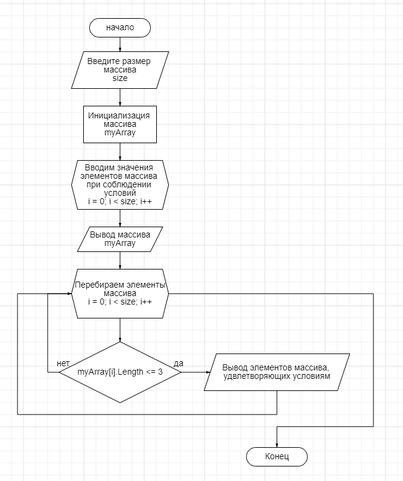

## Текстовое описание решения задачи

1 Создаем переменную size, которая будет считыватся с консоли

2 Инициализируем новый массив типа string размером size

3 В рамках цикла FOR задаем элементы массива

4 Через цикл FOR перебираем все элементы созданного массива и проверяем условие: длина элемента меньше или равна 3-м символам

5 Выводим элементы массива, удволетворящие условиям

## Блок-схема к задаче

